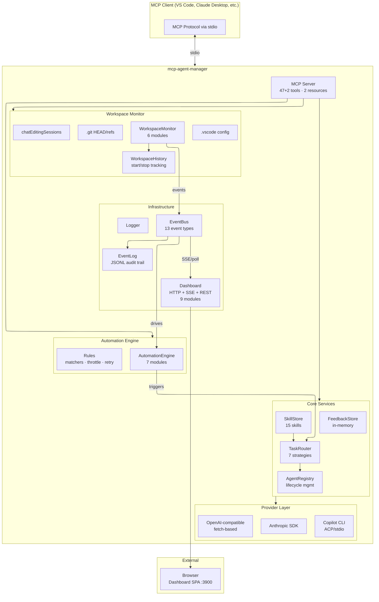
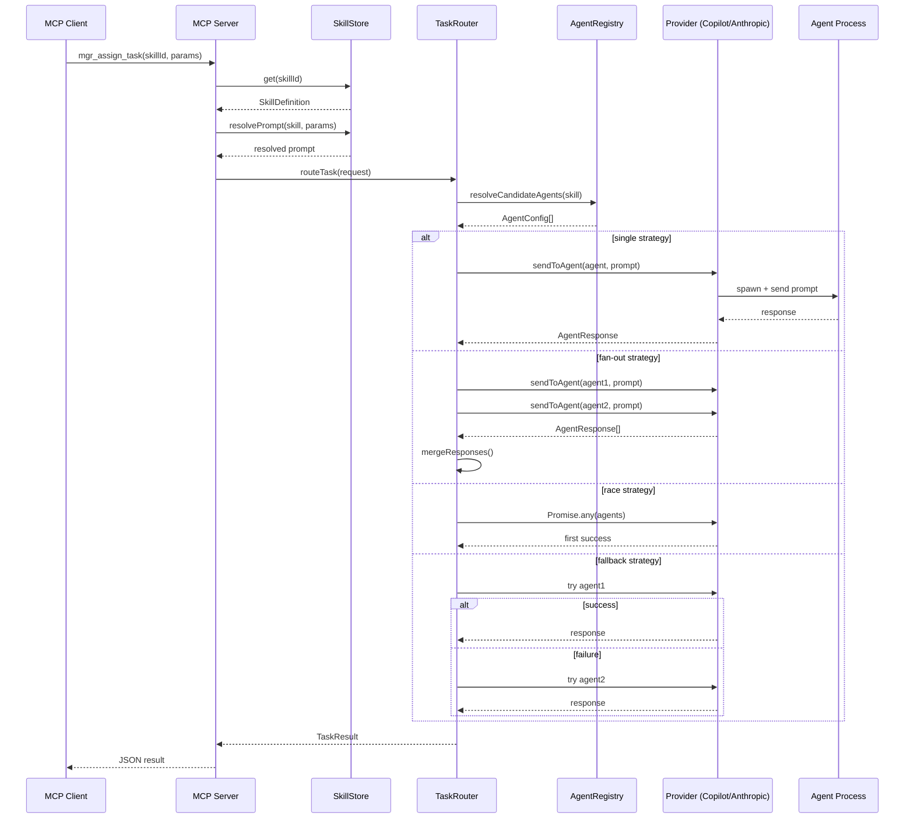
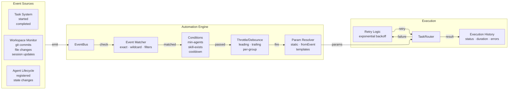
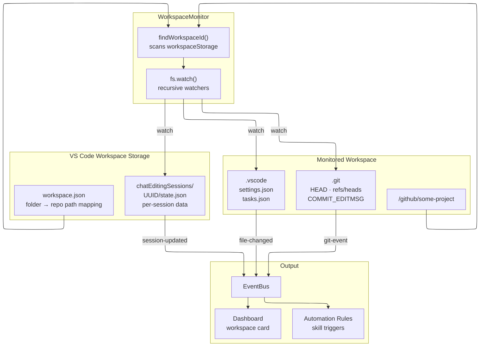
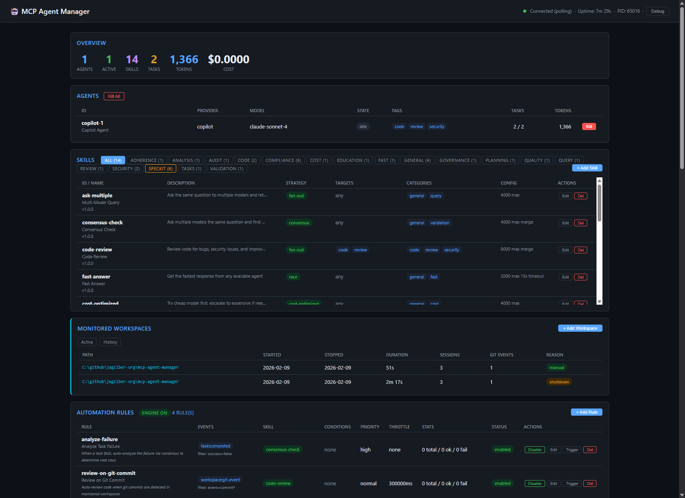

# mcp-agent-manager

MCP server that manages, monitors, and orchestrates AI agents. Register agents (Anthropic Claude, GitHub Copilot CLI, others), define reusable skills with prompt templates, route tasks through configurable strategies, monitor remote workspaces for agent activity, automate skill execution via event-driven rules, dispatch tasks to other repos via cross-repo orchestration with progress notifications, and exchange messages between agents via inter-agent messaging.

## Architecture



## Task Routing Flow



## Automation Engine Flow



## Workspace Monitoring Flow



## Quick Start

```bash
npm install
npm run build
```

### Configure in MCP client

Add to your MCP client config (e.g. VS Code `settings.json`, Claude Desktop `claude_desktop_config.json`):

```json
{
  "mcpServers": {
    "agent-manager": {
      "command": "node",
      "args": ["C:/github/jagilber-org/mcp-agent-manager/dist/server/index.js"],
      "env": {
        "ANTHROPIC_API_KEY": "sk-ant-...",  // pragma: allowlist secret
        "MCP_LOG_LEVEL": "info",
        "MCP_AGENT_DASHBOARD_PORT": "3900"
      }
    }
  }
}
```

## MCP Tools

### Agent Management (7 tools)

| Tool | Description |
|------|-------------|
| `mgr_spawn_agent` | Register an agent (provider, model, tags, capabilities) |
| `mgr_stop_agent` | Unregister agent and kill active sessions |
| `mgr_list_agents` | List all agents with state, stats, capabilities |
| `mgr_agent_status` | Get detailed health info for an agent |
| `mgr_get_agent` | Get full config and runtime state for a single agent |
| `mgr_update_agent` | Partially update agent config (preserves runtime state) |
| `mgr_stop_all` | Kill all agents for clean shutdown |

### Skill Management (5 tools)

| Tool | Description |
|------|-------------|
| `mgr_register_skill` | Create a skill (prompt template + routing config) |
| `mgr_get_skill` | Get a specific skill by ID |
| `mgr_update_skill` | Update an existing skill's configuration |
| `mgr_remove_skill` | Remove a skill by ID |
| `mgr_list_skills` | List all registered skills |

### Task Execution (4 tools)

| Tool | Description |
|------|-------------|
| `mgr_assign_task` | Execute a skill against agent(s) via routing strategy |
| `mgr_send_prompt` | Send raw prompt directly to a specific agent |
| `mgr_list_task_history` | View task execution history with filtering by rule, status, limit |
| `mgr_get_metrics` | Aggregate metrics: tasks, tokens, costs, per-agent breakdown |

### Workspace Monitoring (6 tools)

| Tool | Description |
|------|-------------|
| `mgr_monitor_workspace` | Watch a workspace for chat sessions, git activity, config changes |
| `mgr_stop_monitor` | Stop monitoring a workspace (or "all" to stop all) |
| `mgr_monitor_status` | Get all monitored workspaces with session counts, recent changes |
| `mgr_mine_sessions` | Force immediate re-scan of chat session files for a workspace |
| `mgr_get_workspace` | Get detailed info for a specific monitored workspace |
| `mgr_list_workspace_history` | List workspace monitoring history with start/stop timestamps |

### Automation Engine (8 tools)

| Tool | Description |
|------|-------------|
| `mgr_create_automation` | Create an event-driven rule (event → skill trigger with param mapping) |
| `mgr_get_automation` | Get a specific automation rule by ID |
| `mgr_update_automation` | Update an existing automation rule |
| `mgr_list_automations` | List all rules with status, events, skills, execution stats |
| `mgr_remove_automation` | Remove an automation rule |
| `mgr_toggle_automation` | Enable/disable a rule or the entire engine |
| `mgr_trigger_automation` | Manually trigger a rule with test data (supports dry-run) |
| `mgr_automation_status` | Get engine status, rule stats, recent execution history |

### Cross-Repo Dispatch (5 tools)

| Tool | Description |
| ------ | ------------- |
| `mgr_cross_repo_dispatch` | Dispatch a prompt to another repo via Copilot CLI (model, mutations, timeout) |
| `mgr_cross_repo_batch_dispatch` | Dispatch multiple prompts concurrently to one or more repositories (1-10, parallel via Promise.all) |
| `mgr_cross_repo_status` | Get status of a running or completed cross-repo dispatch |
| `mgr_cross_repo_history` | List cross-repo dispatch history with status/limit filters |
| `mgr_cross_repo_cancel` | Cancel a running cross-repo dispatch or all active dispatches |

### Feedback (4 tools)

| Tool | Description |
| ------ | ------------- |
| `mgr_submit_feedback` | Submit feedback (bug, feature, quality, security) with severity |
| `mgr_list_feedback` | List feedback entries, filter by category/status |
| `mgr_get_feedback` | Get a specific feedback entry by ID |
| `mgr_update_feedback` | Update feedback status (open/acknowledged/resolved/dismissed) |

### Inter-Agent Messaging (8 tools)

| Tool | Description |
| ------ | ------------- |
| `mgr_send_message` | Send a message to other agents via a named channel. Use recipients=["*"] for broadcast or specify agent IDs |
| `mgr_read_messages` | Read messages from a channel (non-destructive peek by default). Supports `includeRead` to re-read messages, `reader="*"` for admin view. Returns diagnostic hints when 0 results but channel has messages |
| `mgr_list_channels` | List all message channels with message counts and latest activity |
| `mgr_ack_messages` | Acknowledge specific messages as read without re-reading the full channel |
| `mgr_message_stats` | Get message statistics for a reader - total, unread, and channel count |
| `mgr_get_message` | Get a single message by ID |
| `mgr_update_message` | Update a message's body, recipients, payload, or persistent flag |
| `mgr_purge_messages` | Delete messages - purge an entire channel, specific message IDs, or all messages |

**`mgr_read_messages` parameters:**

| Parameter | Default | Description |
|-----------|---------|-------------|
| `channel` | *(required)* | Channel to read from |
| `reader` | repo name | Your agent identity. Use `"*"` to see all messages (admin/dashboard view) |
| `unreadOnly` | `true` | Only return messages not yet read by this reader |
| `includeRead` | `false` | When `true`, returns ALL messages including previously read ones (overrides `unreadOnly`) |
| `limit` | `20` | Max messages to return |
| `markRead` | `false` | **Peek mode by default.** Set `true` to mark messages as read/consumed |

### Meta & Insights (2 tools, env-gated)

> Disabled by default. Set `MCP_META_TOOLS=true` to register these tools.

| Tool | Description |
|------|-------------|
| `mgr_get_insights` | Query accumulated agent/skill performance trends (survives restarts) |
| `mgr_search_knowledge` | Search cross-repo knowledge via mcp-index-server (auto-discovered or `MCP_INDEX_URL`) |

## MCP Resources

| Resource | Description |
|----------|-------------|
| `agents://status` | Current agent roster (JSON) |
| `agents://{agentId}/details` | Detailed agent info |

## Routing Strategies

Skills define how tasks are routed to agents:

| Strategy | Behavior |
|----------|----------|
| `single` | Pick best available agent (lowest load, then cheapest) |
| `race` | Send to all, return first successful response |
| `fan-out` | Send to all, collect all responses |
| `consensus` | Fan-out + synthesis pass - compares responses for agreement/disagreement, produces synthesized answer with confidence rating |
| `fallback` | Try agents in cost order, stop on first success. Optional `fallbackOnEmpty` also falls back on near-empty responses |
| `cost-optimized` | Start with cheapest, escalate if multi-factor quality score (relevance, structure, length, error-free) is below `qualityThreshold` |
| `evaluate` | Two-agent workflow - first agent answers, second agent critiques with quality rating, issues, and improvements |

## Automation Engine

The automation engine connects EventBus events to automatic skill invocations via declarative rules. Any event (workspace changes, git commits, agent lifecycle, task completion) can trigger any registered skill.

### Rule Components

- **Event Matcher** - exact event names, wildcards (`workspace:*`), field filters, required fields
- **Parameter Mapping** - static params, event data extraction (dot notation), template interpolation
- **Throttle/Debounce** - leading (fire immediately, ignore) or trailing (wait until quiet), per-group throttling
- **Runtime Conditions** - min-agents available, skill-exists, cooldown checks
- **Retry Logic** - exponential backoff with max retries and delay caps
- **Concurrency Control** - max concurrent executions per rule
- **Audit Trail** - full execution history with status, duration, errors, params

### Example: SpecKit Validation on Git Commit

```
mgr_create_automation:
  id: speckit-on-commit
  name: SpecKit Constitution Check on Commit
  events: ["workspace:git-event"]
  filters: { event: "commit" }
  skillId: speckit-constitution-check
  templateParams:
    context: "Git commit on {event.path}: {event.detail}"
  throttleIntervalMs: 30000
  throttleMode: leading
  throttleGroupBy: path
  conditions:
    - { type: min-agents, value: 1 }
  tags: [speckit, compliance]
```

### Example: Auto Code Review on File Change

```
mgr_create_automation:
  id: review-on-change
  events: ["workspace:file-changed"]
  filters: { kind: "vscode-config" }
  skillId: code-review
  templateParams:
    code: "Changed file: {event.file}"
    context: "Workspace {event.path}, change type: {event.detail}"
  maxConcurrent: 1
```

## Example Workflow

```
1. mgr_spawn_agent: Register a Claude Sonnet agent with tags ["code", "review"]
2. mgr_spawn_agent: Register a Copilot agent with tags ["code", "fast"]
3. mgr_register_skill: Create "code-review" skill with fan-out strategy targeting ["code"] tags
4. mgr_monitor_workspace: Start watching a remote project for git activity
5. mgr_create_automation: Set up rule to auto-run code-review on git commits
6. mgr_assign_task: Execute "code-review" skill manually or wait for automation
7. mgr_get_metrics: Check token usage and costs
8. mgr_automation_status: Review automation execution history
```

## Built-in Skills

### General Skills (9)

| Skill | Strategy | Description |
|-------|----------|-------------|
| `ask-multiple` | fan-out | Query multiple models, compare responses side-by-side |
| `consensus-check` | consensus | Multi-model consensus with synthesized agreement/disagreement analysis |
| `code-review` | fan-out | Structured review (correctness, security, performance, maintainability) with severity ratings and quality score |
| `fast-answer` | race | First response wins (15s timeout) |
| `cost-optimized` | cost-optimized | Quality-threshold escalation (qualityThreshold=0.4) |
| `security-audit` | fan-out | OWASP Top 10 coverage with severity/location/impact/remediation per finding |
| `explain-code` | single | Progressive explanation: summary, key concepts, walkthrough, inputs/outputs, gotchas |
| `commit-review` | evaluate | Doer+critic workflow for git diff review (APPROVE/REQUEST_CHANGES/NEEDS_DISCUSSION) |
| `refactor-suggest` | cost-optimized | Code smell detection with prioritized refactoring suggestions (impact-to-effort ranking) |

### SpecKit Compliance Skills (6)

| Skill | Strategy | Description |
|-------|----------|-------------|
| `speckit-constitution-check` | consensus | Validate project constitution per GitHub Spec Kit |
| `speckit-spec-adherence` | fan-out | Verify implementation matches specification |
| `speckit-plan-review` | consensus | Review plan for completeness and feasibility |
| `speckit-task-validation` | fan-out | Validate tasks trace back to plan and spec |
| `speckit-consistency-analysis` | consensus | Cross-artifact consistency and coverage analysis |
| `speckit-quality-checklist` | fan-out | Generate quality checklist for deployment readiness |

## Dashboard

Real-time web dashboard at `http://127.0.0.1:3900` (configurable port). Self-contained SPA with dark theme.

### V2 Tabbed Layout (`?v=2`)

Access via `http://127.0.0.1:3900/?v=2`. Tabbed interface with badges, keyboard shortcuts (1-9/0, Escape), localStorage persistence.

- **Overview** - agent/skill/task counts, token usage, cost tracking, agent health dots, summary cards, recent activity feed
- **Agents** - live state, tags, provider/model, kill/edit buttons
- **Skills** - full CRUD (add/edit/delete), table with category filter, SpecKit highlighting
- **Workspaces** - monitored paths, chat sessions with token stats, git activity
- **Automation** - full CRUD (add/edit/delete/toggle/trigger), execution stats, throttle status
- **Tasks** - task execution history with skill, strategy, agents, tokens, latency
- **Cross-Repo** - active and completed cross-repo dispatch history with status, tokens, duration
- **Review** - human-in-the-loop feedback, approve/dismiss/flag filters
- **Messaging** - channel overview, message detail view with expand/collapse, compose modal
- **Events** - real-time event stream with search filter, clear button, count badge
- **Debug Panel** - server info, memory, SSE clients, request log, raw snapshot (toggle via header)

### V1 Classic Layout

Access via `http://127.0.0.1:3900/`. All panels visible on a single scrollable page.

Data delivery: polling fallback (2s fetch) as primary, SSE as enhancement. Works in VS Code Simple Browser.

### Dashboard Screenshots

| View | Screenshot |
|------|------------|
| Full Dashboard |  |
| Top Bar |  |
| Skills Panel |  |
| Automation Rules |  |
| Task Results |  |
| Workspaces |  |
| Event Log |  |

## Providers

### Anthropic
Uses `@anthropic-ai/sdk`. Set `ANTHROPIC_API_KEY` env var or pass per-agent via `env` config.

### Copilot CLI (ACP)
Spawns `copilot.exe --acp` as a child process and communicates via JSON-RPC 2.0 (Agent Client Protocol). Requires GitHub Copilot CLI installed via `winget install GitHub.Copilot.Prerelease`.

Set `COPILOT_PATH` env var or provide `binaryPath` in agent config.

### OpenAI-compatible
Fetch-based provider supporting any OpenAI-compatible API: OpenAI, Azure OpenAI, Ollama, LM Studio, and other local inference servers. Configure via agent `endpoint` and optional `OPENAI_API_KEY` env var.

### Provider Capabilities

Each provider declares capabilities via `ProviderCapabilities`:

| Provider | Token Counting | Billing Model | Streaming | Concurrency |
|----------|---------------|---------------|-----------|-------------|
| Copilot CLI | Estimated | premium-request | No | Limited |
| Anthropic | Exact | per-token | Yes | Yes |
| OpenAI-compatible | Exact (when API provides) | per-token | No | Yes |

## Environment Variables

| Variable | Default | Description |
|----------|---------|-------------|
| `ANTHROPIC_API_KEY` | - | Anthropic API key |
| `COPILOT_PATH` | winget default | Path to copilot.exe |
| `MCP_LOG_LEVEL` | `info` | Log level: error, warn, info, debug, trace |
| `MCP_AGENT_DASHBOARD_PORT` | `3900` | Dashboard HTTP server port |
| `MCP_DATA_DIR` | `%APPDATA%/mcp-agent-manager` | Base data directory for all persistence |
| `AGENTS_DIR` | `<data-dir>/agents` | Directory for agent config persistence |
| `SKILLS_DIR` | `<data-dir>/skills` | Directory for skill persistence |
| `AUTOMATION_RULES_DIR` | `<data-dir>/automation` | Directory for automation rule persistence |
| `CONFIG_DIR` | `<data-dir>/config` | Directory for monitors.json and workspace-history.json |
| `EVENT_LOG_DIR` | `<data-dir>/logs` | Directory for events.jsonl and feedback.jsonl |
| `META_DIR` | `<data-dir>/meta` | Directory for agent-meta.jsonl insights |
| `MCP_META_ENABLED` | `true` | Enable/disable meta collection (agent/skill performance tracking) |
| `MCP_META_FLUSH_INTERVAL` | `60000` | How often to flush meta stats to disk (ms) |
| `MCP_META_TOOLS` | `false` | Register `mgr_get_insights` + `mgr_search_knowledge` MCP tools |
| `MCP_INDEX_URL` | auto-discovered | Explicit base URL override for mcp-index-server (auto-discovered from VS Code mcp.json if not set) |
| `MCP_META_SYNC_INTERVAL` | `300000` | How often to sync insights to index-server (ms, default 5min) |
| `STATE_DIR` | `<data-dir>/state` | Directory for cross-process shared state (task history, router metrics, cross-repo history) |

### Data Directory Resolution

All persistent data is stored under a central data directory. The resolution order is:

1. `MCP_DATA_DIR` env var (if set)
2. Platform default:
   - **Windows**: `%APPDATA%\mcp-agent-manager`
   - **macOS**: `~/Library/Application Support/mcp-agent-manager`
   - **Linux**: `$XDG_CONFIG_HOME/mcp-agent-manager` (or `~/.config/mcp-agent-manager`)

Individual subdirectory env vars (`AGENTS_DIR`, `SKILLS_DIR`, etc.) override specific paths within the data directory.

## Persistence & Data Files

All state is persisted to JSON/JSONL files under the central data directory. Directories are auto-created on first startup.

| File | Format | Content | Write Method | Env Override |
|------|--------|---------|-------------|---------------|
| `agents/agents.json` | JSON array | AgentConfig[] (config only, no runtime state) | Full overwrite (`writeFileSync`) | `AGENTS_DIR` |
| `skills/skills.json` | JSON array | SkillDefinition[] | Full overwrite (`writeFileSync`) | `SKILLS_DIR` |
| `automation/rules.json` | JSON array | AutomationRule[] (execution history is in-memory only) | Full overwrite (`writeFileSync`) | `AUTOMATION_RULES_DIR` |
| `config/monitors.json` | JSON array | string[] (monitored workspace paths) | Full overwrite (`writeFileSync`) | `CONFIG_DIR` |
| `config/workspace-history.json` | JSON array | WorkspaceHistoryEntry[] (start/stop records) | Full overwrite (`writeFileSync`) | `CONFIG_DIR` |
| `logs/events.jsonl` | JSONL | One JSON object per line `{ts, event, ...data}` | Append (`appendFileSync`) | `EVENT_LOG_DIR` |
| `meta/agent-meta.jsonl` | JSONL | Agent/skill performance snapshots + task records | Periodic append (flush interval) | `META_DIR` |
| `state/task-history.jsonl` | JSONL | Task execution history entries | Append after each task | `STATE_DIR` |
| `state/crossrepo-history.jsonl` | JSONL | Cross-repo dispatch results | Append after each dispatch | `STATE_DIR` |
| `state/router-metrics.json` | JSON | Aggregate router metrics (tasks, tokens, cost) | Atomic rename after each task | `STATE_DIR` |
| `state/agent-stats.json` | JSON | Agent performance stats snapshot | Atomic rename on dashboard poll | `STATE_DIR` |
| `state/.state-version` | Text | Monotonic version sentinel for change detection | Increment on any state write | `STATE_DIR` |

**Key behaviors:**
- All writes are **immediate and synchronous** - no batching or deferred saves
- **Shared state** persists task history, cross-repo history, and router metrics to `state/` directory for cross-process visibility (dashboard reads from disk when in-memory is empty)
- Shared state uses **JSONL append** for history and **atomic rename** for snapshots (with Windows EPERM retry)
- Agent runtime state (task counts, tokens, costs) is **not persisted** - only configs survive restart
- **Meta collector** persists agent/skill performance trends to `meta/agent-meta.jsonl` - survives restarts
- Automation execution history (success/failure/throttled stats) is **in-memory only**
- Events log is **append-only** with no rotation/truncation - manage externally if needed
- During graceful shutdown, `monitors.json` is NOT overwritten (prevents saving empty state)
- When `MCP_INDEX_URL` is set, meta insights are synced to mcp-index-server for cross-repo sharing
- Index-server URL is **auto-discovered** from VS Code's `mcp.json` - no manual config needed if mcp-index-server is installed
- A **circuit breaker** prevents any performance impact when index-server is unreachable (3 failures → 60s cooldown)
- When the circuit breaker opens, agent-manager **auto-starts** the index-server by discovering its spawn config from VS Code's `mcp.json`

## Logging & Troubleshooting

All logging goes to **stderr** via the structured logger. MCP clients (VS Code, Claude Desktop) automatically capture stderr output and display it in their Output panel.

### Viewing Logs in VS Code

1. Open the **Output** panel (`Ctrl+Shift+U`)
2. Select **MCP: agent-manager** from the dropdown
3. All server logs (info, warn, error) appear here in real-time

### Log Levels

Set `MCP_LOG_LEVEL` in your MCP client config to control verbosity:

| Level | Shows | Use Case |
|-------|-------|----------|
| `error` | Errors only | Production |
| `warn` | Errors + warnings | Normal operation |
| `info` | Above + lifecycle events, CRUD operations | Default |
| `debug` | Above + persistence saves, internal state | Development |
| `trace` | Everything including detailed data payloads | Deep debugging |

### Log Format

```
[2026-02-09T16:33:13.033Z] [INFO] Registered skill: code-review
[2026-02-09T16:33:13.034Z] [DEBUG] Persisted 14 skills
[2026-02-09T16:33:13.045Z] [ERROR] Failed to persist automation rules {"error":"EACCES"}
```

### Common Troubleshooting

| Symptom | Check |
|---------|-------|
| Skills/rules not surviving restart | Verify write permissions to `skills/`, `automation/`, `config/` directories |
| Dashboard not loading | Check port 3900 isn't in use: `Get-NetTCPConnection -LocalPort 3900` |
| Agent state reset after restart | Expected - runtime state (tasks, tokens) is in-memory only |
| events.jsonl growing large | No auto-rotation - truncate or archive manually |
| Automation rules not firing | Check `MCP_LOG_LEVEL=debug` for throttle/condition skip messages |
| Dashboard shows stale data | SSE reconnects automatically; try hard refresh (`Ctrl+Shift+R`) |

## Development

```bash
npm run build        # Compile TypeScript
npm run dev          # Run with --watch
npm run typecheck    # Type check without emitting
npm run test         # Run vitest (514 tests)
npm run test:cdp     # Run CDP regression tests (34 tests, requires Chrome)
npm run lint         # ESLint
```

### Test Coverage (514 unit tests + 34 CDP tests)

- **basic.test.ts** (8 tests) - AgentRegistry CRUD, tag filtering, concurrency, task stats, EventBus
- **agent-registry.test.ts** (13 tests) - Agent lifecycle, state machine, tag/provider queries, health checks
- **agents-config.test.ts** (28 tests) - Agent configuration validation, defaults, persistence
- **skill-store.test.ts** (5 tests) - Skill CRUD, prompt resolution, category listing, search
- **skill-crud.test.ts** (9 tests) - Dashboard skill add/edit/delete API tests
- **skill-api.test.ts** (9 tests) - Skill REST API endpoint tests
- **task-router.test.ts** (8 tests) - All 6 routing strategies, event emission, metrics
- **routing-strategies.test.ts** (13 tests) - Consensus synthesis, cost-optimized quality eval, fallback empty, evaluate two-agent workflow, metrics propagation
- **search-strategy.test.ts** (10 tests) - Skill search and strategy resolution tests
- **event-bus.test.ts** (3 tests) - Workspace, agent, task event propagation
- **automation-crud.test.ts** (21 tests) - Rule CRUD, configuration, enable/disable
- **automation-crud-extended.test.ts** (9 tests) - Extended automation CRUD (get/update)
- **automation-matching.test.ts** (22 tests) - Parameter resolution, event matching, conditions, edge cases
- **automation-execution.test.ts** (19 tests) - Trigger, dry-run, history, execution records, integration scenarios
- **automation-pipeline.test.ts** (11 tests) - Event→skill pipeline, full round trips
- **automation-api.test.ts** (12 tests) - Automation REST API endpoint tests
- **dashboard-html.test.ts** (5 tests) - HTML structure, JS syntax validation, required sections
- **dashboard-html-crud.test.ts** (13 tests) - Dashboard CRUD HTML generation tests
- **workspace-crud.test.ts** (9 tests) - Workspace CRUD API tests
- **workspace-api.test.ts** (9 tests) - Workspace REST API tests
- **workspace-history.test.ts** (11 tests) - Workspace history tracking and persistence tests
- **cross-repo.test.ts** (29 tests) - Cross-repo dispatch execution, status/history, cancellation, copilot detection, token estimation
- **cross-repo-truncation.test.ts** (15 tests) - Cross-repo response truncation and spillover tests
- **meta-collector.test.ts** (36 tests) - Meta collection enable/disable, insights, agent registry sync, event accumulation, index client
- **data-dir.test.ts** (10 tests) - Central data directory resolution, env overrides, migration
- **provider-framework.test.ts** (12 tests) - Provider capabilities registry, billing models, type contracts, binary resolution
- **agent-mailbox.test.ts** (67 tests) - Inter-agent messaging: send, directed/broadcast routing, read status tracking, peek mode, includeRead, wildcard reader, peekChannel diagnostics, acknowledge, channels, stats, TTL expiration, ordering, channel isolation, purge
- **feedback-store.test.ts** (23 tests) - Feedback CRUD, filtering, persistence, cross-instance reload
- **shared-state.test.ts** (21 tests) - Cross-process shared state, version sentinel, atomic writes
- **corrupted-files.test.ts** (22 tests) - Corrupted file recovery for all JSON/JSONL stores
- **hot-reload-extended.test.ts** (14 tests) - Hot-reload via ConfigWatcher for all watched modules
- **config-watcher.test.ts** (15 tests) - ConfigWatcher core: external detection, debounce, self-write suppression
- **multi-instance.test.ts** (17 tests) - Multi-instance disk integrity, concurrent access, version sentinel

### CDP Regression Tests (34 tests)

Browser-based regression tests using `puppeteer-core` and Chrome DevTools Protocol. Located in `tests/dashboard-cdp.mjs`.

```bash
node tests/dashboard-cdp.mjs    # Requires Chrome + running dashboard on :3900
```

Tests all dashboard CRUD operations end-to-end: skills add/edit/delete, automation rules add/edit/toggle/trigger/delete, workspace add/mine/stop/history, event log search/clear/count.

## Project Structure

```
src/
  server/
    index.ts              - MCP server entry point (slim, 89 lines)
    resources.ts          - MCP resource handlers
    eventWiring.ts        - Event log + automation wiring
    tools/
      agentTools.ts       - Agent management tools (7)
      taskTools.ts        - Task & prompt tools (4)
      skillTools.ts       - Skill management tools (5)
      automationTools.ts  - Automation engine tools (8)
      monitorTools.ts     - Workspace monitor tools (6)
      feedbackTools.ts    - Feedback tools (4)
      crossRepoTools.ts   - Cross-repo dispatch tools (5, with progress notifications)
      messagingTools.ts   - Inter-agent messaging tools (6)
      metaTools.ts        - Meta & insights tools (2, env-gated)
  services/
    agentRegistry.ts      - Agent lifecycle management
    dataDir.ts            - Central data directory resolution
    events.ts             - Typed EventBus (13 event types)
    eventLog.ts           - JSONL event persistence
    skillStore.ts         - Skill CRUD + persistence
    taskRouter.ts         - 6-strategy orchestration engine
    copilot.ts            - Copilot session management
    crossRepoDispatcher.ts - Cross-repo task dispatch via Copilot CLI
    sharedState.ts        - Cross-process shared state (JSONL + atomic JSON persistence)
    metaCollector.ts      - Agent/skill performance collection + index-server sync
    agentMailbox.ts       - Inter-agent messaging service (send/read/ack/stats/channels)
    indexClient.ts        - HTTP client for mcp-index-server integration (with auto-start)
    feedbackStore.ts      - In-memory feedback store
    logger.ts             - Structured logging
    automation/           - Event-driven skill trigger engine (7 modules)
      index.ts            - AutomationEngine class (slim orchestrator)
      execution.ts        - Execution pipeline
      matching.ts         - Rule matching & param resolution
      helpers.ts          - Constants & utility functions
      retryQueue.ts       - Exponential backoff retry logic
      reviewQueue.ts      - Human-in-the-loop review queue
      rulePersistence.ts  - Disk persistence for rules
    dashboard/            - HTTP dashboard + SSE + SPA (9 modules)
      index.ts            - Route registration
      api.ts              - REST API handlers
      sse.ts              - Server-sent events
      snapshot.ts         - Dashboard data snapshot builder
      html.ts             - HTML template assembly
      htmlStyles.ts       - CSS styles
      htmlStructure.ts    - HTML structure/layout
      htmlRenderScript.ts - Client-side rendering JS
      htmlActionScript.ts - Client-side action JS
    workspace/            - Workspace monitoring (6 modules)
      index.ts            - WorkspaceMonitor class (slim orchestrator)
      types.ts            - Interfaces & constants
      discovery.ts        - VS Code workspace ID discovery
      fileWatcher.ts      - Directory watcher with debounce
      gitMonitor.ts       - Git HEAD/ref watchers + remote fetch
      sessionMiner.ts     - Chat session JSONL mining
      workspaceHistory.ts - Start/stop tracking with persistence
  providers/
    anthropic.ts          - Anthropic SDK provider
    copilot.ts            - Copilot CLI (ACP) provider + binary resolution
    openai.ts             - OpenAI-compatible provider (fetch-based)
    types.ts              - ProviderCapabilities interface + BillingModel type
    index.ts              - Provider registration + capabilities registry
  types/
    index.ts              - Barrel exports
    agent.ts              - Agent types
    skill.ts              - Skill types
    task.ts               - Task types
    metrics.ts            - Metrics types
    automation.ts         - Automation engine types
    crossRepo.ts          - Cross-repo dispatch types
tests/
  helpers/setup.ts        - Shared fixtures, spies, mock providers
  basic.test.ts           - Core subsystem unit tests
  agent-registry.test.ts  - Agent lifecycle tests
  agents-config.test.ts   - Agent configuration tests
  skill-store.test.ts     - Skill CRUD tests
  skill-crud.test.ts      - Dashboard skill API tests
  skill-api.test.ts       - Skill REST endpoint tests
  task-router.test.ts     - Routing strategy tests
  routing-strategies.test.ts - Strategy improvement tests
  search-strategy.test.ts - Skill search strategy tests
  event-bus.test.ts       - Event propagation tests
  automation-crud.test.ts - Automation rule CRUD tests
  automation-crud-extended.test.ts - Extended CRUD (get/update)
  automation-matching.test.ts  - Param resolution & matching tests
  automation-execution.test.ts - Trigger & history tests
  automation-pipeline.test.ts  - End-to-end pipeline tests
  automation-api.test.ts  - Automation REST API tests
  dashboard-html.test.ts  - Dashboard HTML validation
  dashboard-html-crud.test.ts - Dashboard CRUD HTML tests
  workspace-crud.test.ts  - Workspace CRUD API tests
  workspace-api.test.ts   - Workspace REST API tests
  workspace-history.test.ts - Workspace history tests
  cross-repo.test.ts      - Cross-repo dispatch tests
  cross-repo-truncation.test.ts - Response truncation tests
  meta-collector.test.ts  - Meta collection tests
  data-dir.test.ts        - Data directory tests
  provider-framework.test.ts - Provider capabilities tests
  agent-mailbox.test.ts   - Inter-agent messaging tests
  feedback-store.test.ts  - Feedback CRUD & persistence tests
  shared-state.test.ts    - Cross-process shared state tests
  corrupted-files.test.ts - Corrupted file recovery tests
  hot-reload-extended.test.ts - Hot-reload tests
  config-watcher.test.ts  - ConfigWatcher tests
  multi-instance.test.ts  - Multi-instance disk integrity tests
  dashboard-cdp.mjs       - CDP browser regression tests (34 tests)
skills/
  skills.json             - 15 built-in skill definitions
automation/
  rules.json              - Persisted automation rules
config/
  monitors.json           - Persisted monitored workspace paths
  workspace-history.json  - Workspace start/stop history
docs/
  architecture.md         - System architecture with Mermaid diagrams
  logical.md              - Logical data flow with Mermaid diagrams
  prd.md                  - Product requirements document
  plan.md                 - Implementation plan
  screenshots/            - Dashboard screenshots (7 PNGs)
```

## License

MIT - see [LICENSE](LICENSE) for details.
