# MCP Agent Manager - Architecture

## SpecKit Development Lifecycle

The iterative development cycle. The linear pipeline (specify→plan→tasks→implement) includes loop-back points for when scope drifts, quality gates fail, or periodic audits surface gaps.

```mermaid
flowchart TD
  NEED["Feature Need / Bug Report"] --> SPECIFY["/speckit.specify<br/>Create spec with user stories"]
  SPECIFY --> PLAN["/speckit.plan<br/>Architecture + phase breakdown"]
  PLAN --> TASKS["/speckit.tasks<br/>Break into actionable tasks"]
  TASKS --> IMPL["/speckit.implement<br/>TDD: write test → fail → code → pass"]

  IMPL --> RED["🔴 Write test (FAIL)"]
  RED --> GREEN["🟢 Implement (PASS)"]
  GREEN --> REFACTOR["♻️ Refactor"]
  REFACTOR --> TEST_PASS{"All tests pass?"}

  TEST_PASS -->|No| RED
  TEST_PASS -->|Yes| BUILD{"Build clean?"}
  BUILD -->|No| GREEN
  BUILD -->|Yes| GATES{"Constitution gates?"}

  GATES -->|"Scope drift"| SPECIFY
  GATES -->|"Quality fail"| GREEN
  GATES -->|Pass| COMMIT["Commit + Push"]

  COMMIT --> AUDIT["/speckit.constitution<br/>Periodic audit"]
  AUDIT -->|"Gaps found"| SPECIFY
  AUDIT -->|Clean| DONE["✅ Complete"]

  style RED fill:#fee,stroke:#c33
  style GREEN fill:#efe,stroke:#3c3
  style REFACTOR fill:#eef,stroke:#33c
  style DONE fill:#efe,stroke:#3c3
```

## System Architecture

## Startup Sequence

## Event Flow

## Task Routing Strategies

```mermaid
%%{init: {"flowchart": {"defaultRenderer": "elk"}} }%%
flowchart TB
  REQ[TaskRequest<br/>skillId + params] --> RESOLVE[Resolve Skill<br/>+ Prompt Template]
  RESOLVE --> AGENTS[Resolve Candidate Agents<br/>targetAgents → targetTags → fallback all]

  AGENTS --> STRAT{Strategy?}

  STRAT -->|single| S1[Pick first available<br/>→ 1 response]
  STRAT -->|race| S2[Send to all in parallel<br/>→ first success wins]
  STRAT -->|fan-out| S3[Send to all in parallel<br/>→ collect all responses]
  STRAT -->|consensus| S4[Send to all<br/>→ merge with headers]
  STRAT -->|fallback| S5[Try cheapest first<br/>→ next on failure]
  STRAT -->|cost-optimized| S6[Start cheapest<br/>→ escalate if short]

  S1 & S2 & S3 & S4 & S5 & S6 --> RESULT[TaskResult<br/>responses + finalContent<br/>+ metrics]

  RESULT --> EVENTS[Emit task:completed<br/>→ EventBus]
```

## Persistence Model

All data is stored under a central data directory (`%APPDATA%/mcp-agent-manager` on Windows, `~/.config/mcp-agent-manager` on Linux, `~/Library/Application Support/mcp-agent-manager` on macOS). Override with `MCP_DATA_DIR` env var.

| File | Format | Content | Loaded At | Saved On | Write Method | Env Override |
|------|--------|---------|-----------|----------|-------------|---------------|
| agents/agents.json | JSON array | AgentConfig[] (config only) | Startup (load) | register/update/unregister | writeFileSync (overwrite) | `AGENTS_DIR` |
| skills/skills.json | JSON array | SkillDefinition[] | Startup (load) | register/remove/update | writeFileSync (overwrite) | `SKILLS_DIR` |
| automation/rules.json | JSON array | AutomationRule[] | initialize() | registerRule/removeRule/updateRule/toggle | writeFileSync (overwrite) | `AUTOMATION_RULES_DIR` |
| config/monitors.json | JSON array | string[] (paths) | loadPersistedMonitors() | start/stop (not shutdown) | writeFileSync (overwrite) | `CONFIG_DIR` |
| config/workspace-history.json | JSON array | WorkspaceHistoryEntry[] | startup | recordStop (auto) | writeFileSync (overwrite) | `CONFIG_DIR` |
| logs/events.jsonl | JSONL | EventEntry lines | Read-only | On every event emit | appendFileSync (append) | `EVENT_LOG_DIR` |
| logs/feedback.jsonl | JSONL | FeedbackEntry lines | initFeedbackStore() | submit/update | appendFileSync (append) | `EVENT_LOG_DIR` |
| meta/agent-meta.jsonl | JSONL | Agent/skill/task meta snapshots | initMetaCollector() | Periodic flush (60s) | appendFileSync (append) | `META_DIR` |
| state/task-history.jsonl | JSONL | Task execution history entries | On demand | After each task | appendFileSync (append) | `STATE_DIR` |
| state/crossrepo-history.jsonl | JSONL | Cross-repo dispatch results | On demand | After each dispatch | appendFileSync (append) | `STATE_DIR` |
| state/router-metrics.json | JSON | Aggregate router metrics | On demand | Atomic rename after task | writeFileSync + rename | `STATE_DIR` |
| state/agent-stats.json | JSON | Agent performance stats | On demand | Atomic rename on poll | writeFileSync + rename | `STATE_DIR` |
| state/.state-version | Text | Monotonic version sentinel | On demand | Increment on any write | writeFileSync (overwrite) | `STATE_DIR` |

**Note:** All writes are synchronous and immediate. Shared state uses **JSONL append** for history files and **atomic rename** for snapshot files (with Windows EPERM retry). Agent runtime state (task counts, tokens, error state) and automation execution history are in-memory only - not persisted. Meta collector accumulates performance trends that survive restarts.

## MCP Tools (43 + 2 env-gated)

| Category | Tools |
|----------|-------|
| Agent Management (7) | mgr_spawn_agent, mgr_stop_agent, mgr_list_agents, mgr_agent_status, mgr_get_agent, mgr_update_agent, mgr_stop_all |
| Skill Management (5) | mgr_register_skill, mgr_get_skill, mgr_update_skill, mgr_remove_skill, mgr_list_skills |
| Task Execution (4) | mgr_assign_task, mgr_send_prompt, mgr_list_task_history, mgr_get_metrics |
| Automation (8) | mgr_create_automation, mgr_get_automation, mgr_update_automation, mgr_list_automations, mgr_remove_automation, mgr_toggle_automation, mgr_trigger_automation, mgr_automation_status |
| Workspace Monitoring (6) | mgr_monitor_workspace, mgr_stop_monitor, mgr_monitor_status, mgr_mine_sessions, mgr_get_workspace, mgr_list_workspace_history |
| Feedback (4) | mgr_submit_feedback, mgr_list_feedback, mgr_get_feedback, mgr_update_feedback |
| Cross-Repo Dispatch (4) | mgr_cross_repo_dispatch, mgr_cross_repo_status, mgr_cross_repo_history, mgr_cross_repo_cancel |
| Inter-Agent Messaging (8) | mgr_send_message, mgr_read_messages, mgr_list_channels, mgr_ack_messages, mgr_message_stats, mgr_get_message, mgr_update_message, mgr_purge_messages |
| Meta & Insights (2) ★ | mgr_get_insights, mgr_search_knowledge |

★ Meta tools require `MCP_META_TOOLS=true` to register. Off by default to keep tool list clean.

## MCP Resources (2)

| URI | Description |
|-----|-------------|
| manager://status | Full system status JSON |
| manager://agents | All agent instances with state |
