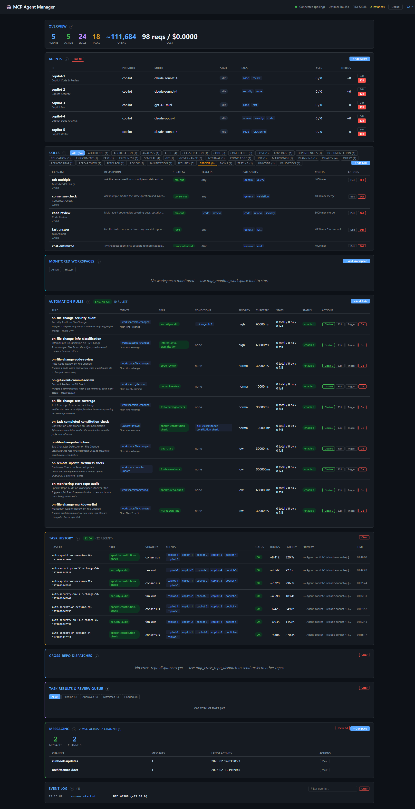
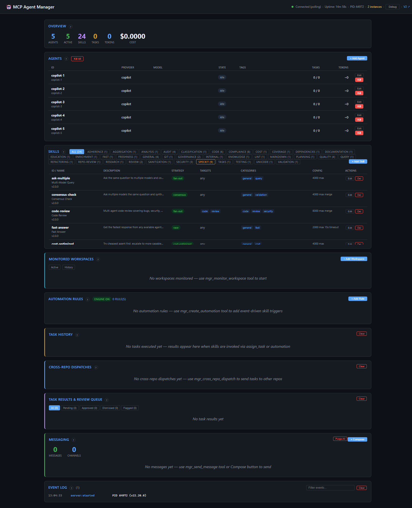
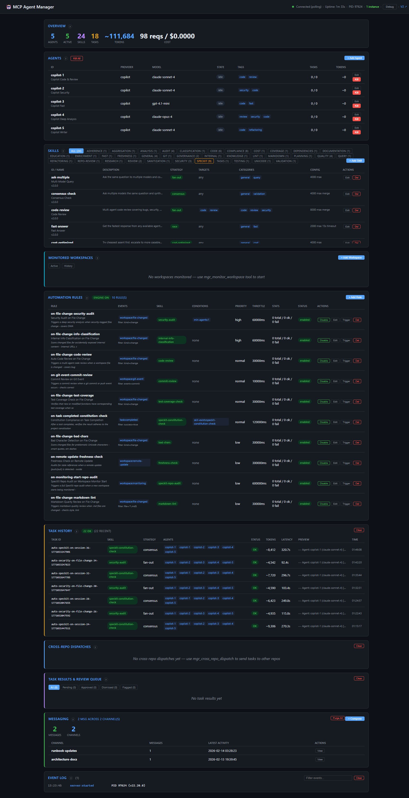
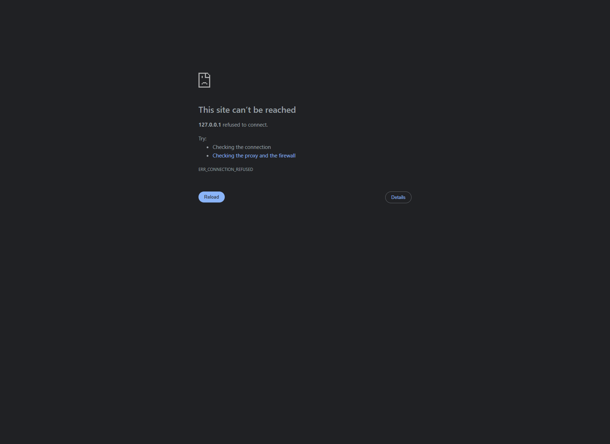

# Dashboard Divergence Report

**Date:** 2026-02-15
**Verified via:** Chrome DevTools MCP (evaluate_script, take_screenshot)

---

## Problem

Port 3900 and port 3901 dashboards showed different data:

| Data Point       | Port 3900 (BEFORE fix)                     | Port 3901 (BEFORE fix)                              |
| ---------------- | ------------------------------------------ | ---------------------------------------------------- |
| Agents           | `copilot-1..5` (generic defaults)          | `Copilot Code & Review`, etc. (custom from agents.json) |
| Messages         | 0 channels, 0 messages                     | 2 channels, 2 messages                               |
| Automation Rules | error: "not found"                         | error: "not found"                                   |
| Metrics          | 0 tasks, 0 tokens                          | 18 tasks, 111684 tokens                              |
| MCP_ env vars    | **NONE** (`"env": {}`)                     | All 4 present                                        |

### Screenshot: Port 3901 (before fix - stale data from dead server)


### Screenshot: Port 3900 (before fix - wrong data dir)


---

## Root Cause

**Port 3900 (PID 64972) was a stale process started WITHOUT `MCP_DATA_DIR` env var.**

Chrome DevTools proof from `/api/debug`:

```
Port 3900 (PID 64972): "env": {}           ← NO MCP_ env vars at all
Port 3901 (PID 62288): "env": {
  "MCP_AGENT_DASHBOARD_PORT": "3900",
  "MCP_DATA_DIR": "C:/github/jagilber-org/mcp-agent-manager",
  "MCP_KEEP_ALIVE": "1",
  "MCP_LOG_LEVEL": "info"
}
```

Without `MCP_DATA_DIR`, port 3900 fell back to `%APPDATA%\mcp-agent-manager\` which had:
- `agents.json`: `[]` (empty) → server registered generic defaults `copilot-1..5`
- `messages.jsonl`: 0 bytes (cleaned in prior session)
- `rules.json`: `[]` (empty) → 0 automation rules

Port 3901 was the **actual VS Code instance** with correct env vars. It tried port 3900 (taken by stale process), auto-incremented to 3901, and loaded from the repo data dir correctly.

### How the stale process got there

The stale PID 64972 had `CommandLine: "C:\Program Files\nodejs\node.exe" dist/server/index.js` (full node path), while the VS Code instance had `CommandLine: node dist/server/index.js` (relative). This indicates PID 64972 was either:
- Started from a terminal without env vars before mcp.json was configured
- Left over from a prior VS Code session that lost its env vars on restart

---

## Fixes Applied

### 1. Added `DATA_DIR` to `/api/debug` endpoint

`src/services/dashboard/api.ts`: Added `dataDir: DATA_DIR` to the debug response so the data directory is always visible for diagnostics.

### 2. Cleaned test-polluted `messages.jsonl`

Previous sessions' `messaging-api.test.ts` wrote 29 test messages (across 20 junk channels like `snap-b`, `dedup-ch`, `limit-ch`) to the real `%APPDATA%` messages.jsonl because `createPersistSpies()` lacked mailbox mocks.

### 3. Added mailbox persistence spies to `createPersistSpies()`

`tests/helpers/setup.ts`: Added spies for `appendMessageToLog`, `rewriteMessageLog`, `broadcastToPeers` to prevent future test pollution.

### 4. Build killed all stale servers

`npm run build` triggered `kill-stale-servers.cjs` which killed all 4 stale node processes (PIDs 64972, 71216, 62288, 51428).

---

## Verification (AFTER fix)

VS Code Insiders restarted the mcp-agent-manager. Chrome DevTools confirmed:

### Port 3900 API data (via evaluate_script)

```json
{
  "server": {
    "pid": 97624,
    "port": 3900,
    "dataDir": "C:\\github\\jagilber-org\\mcp-agent-manager"
  },
  "env": {
    "MCP_AGENT_DASHBOARD_PORT": "3900",
    "MCP_DATA_DIR": "C:/github/jagilber-org/mcp-agent-manager",
    "MCP_KEEP_ALIVE": "1",
    "MCP_LOG_LEVEL": "info"
  },
  "agents": [
    {"name": "Copilot Code & Review", "state": "idle"},
    {"name": "Copilot Security", "state": "idle"},
    {"name": "Copilot Fast", "state": "idle"},
    {"name": "Copilot Deep Analysis", "state": "idle"},
    {"name": "Copilot Writer", "state": "idle"}
  ],
  "messaging": {
    "channelCount": 2,
    "channels": [
      {"channel": "runbook-updates", "messages": 1},
      {"channel": "architecture-docs", "messages": 1}
    ],
    "totalMessages": 2
  },
  "automation": {
    "enabled": true,
    "ruleCount": 10,
    "activeRules": 10
  }
}
```

### Screenshot: Port 3900 (after fix - correct data)


### Screenshot: Port 3901 (after fix - not running, connection refused)


Port 3901 correctly shows connection refused — only one VS Code window is open, so only one instance runs on port 3900.

---

## Two-Instance Behavior

When two VS Code Insiders windows are open with the same workspace:
1. Both launch `mcp-agent-manager` with identical env vars from `mcp.json`
2. First instance gets port 3900
3. Second instance tries 3900, finds it taken, auto-increments to 3901
4. Both use `MCP_DATA_DIR=C:/github/jagilber-org/mcp-agent-manager`
5. Both read the same agents.json, skills.json, messages.jsonl, rules.json
6. ConfigWatcher detects cross-instance file changes and reloads data

**They will show the same data** as long as both have `MCP_DATA_DIR` set correctly.

---

## Test Results

```
 Test Files  36 passed (36)
      Tests  631 passed (631)
   Duration  11.13s
```

Messaging API test pollution check: ran 24 messaging tests, `messages.jsonl` stayed at 0 bytes (spies working).
