# MCP Agent Manager - Logical Data Flow

## Module Dependency Graph

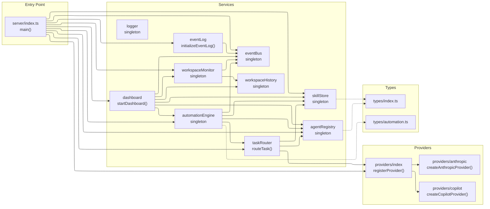

## Data Entity Relationships

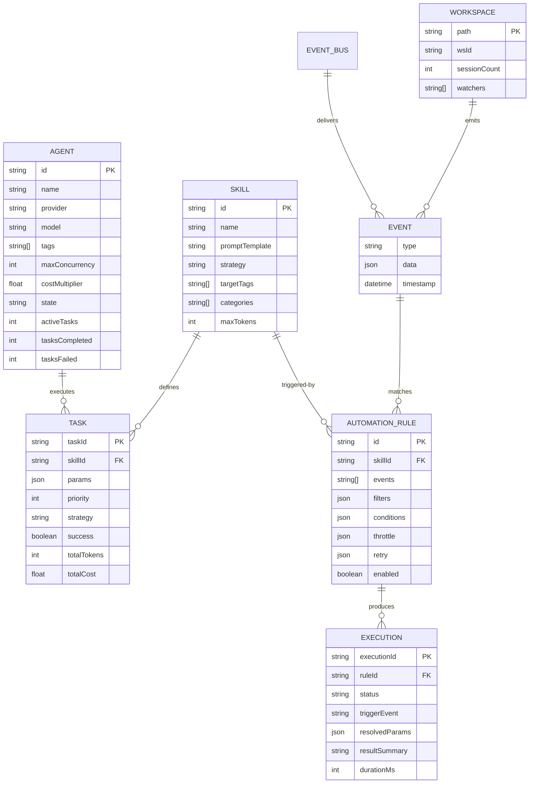

## Request Processing Pipeline

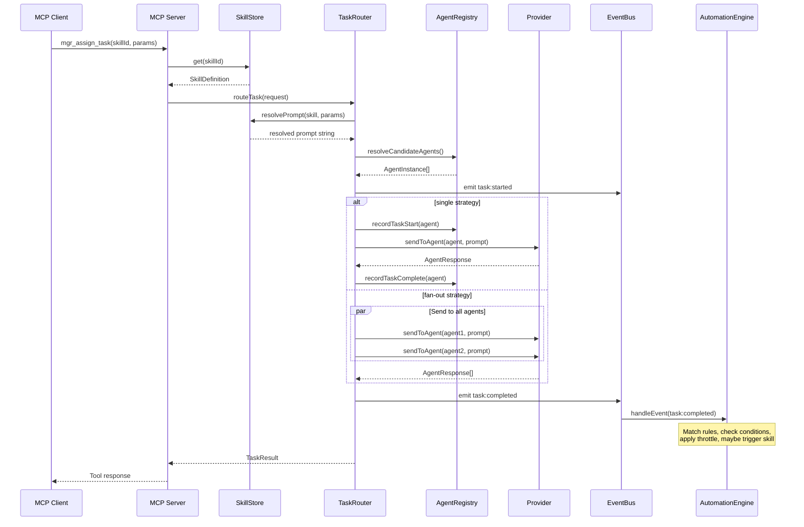

## Workspace Event Pipeline

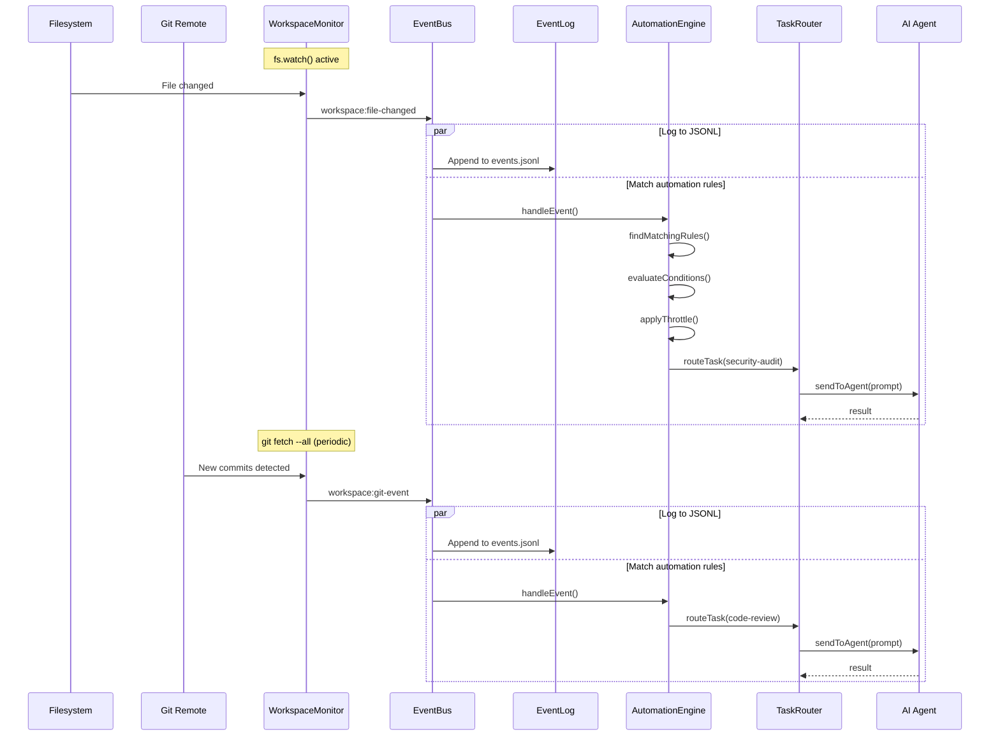

## State Machine - Agent Lifecycle

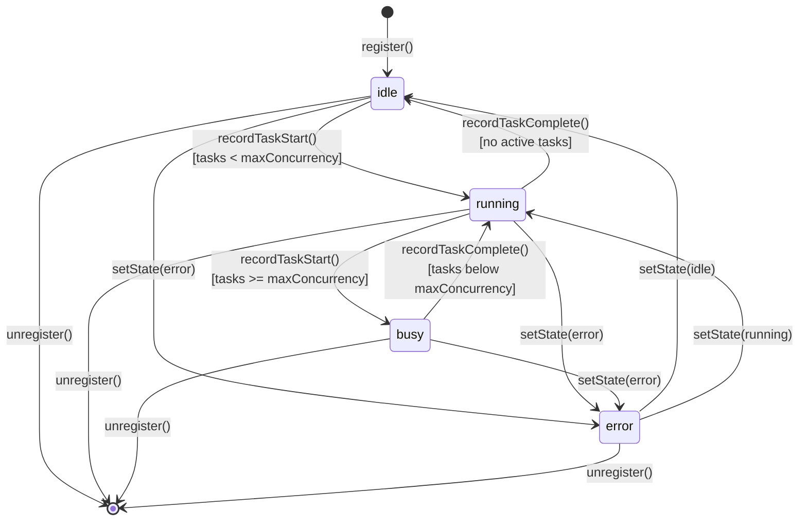

## Graceful Shutdown Sequence

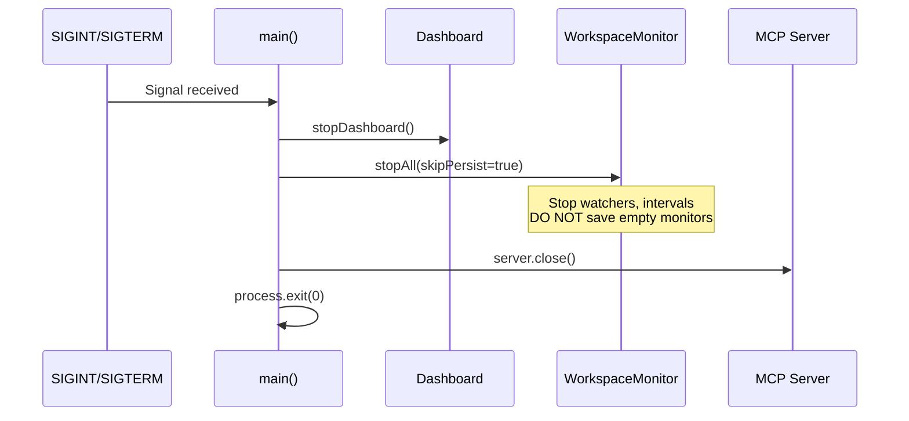

## Dashboard REST API Architecture

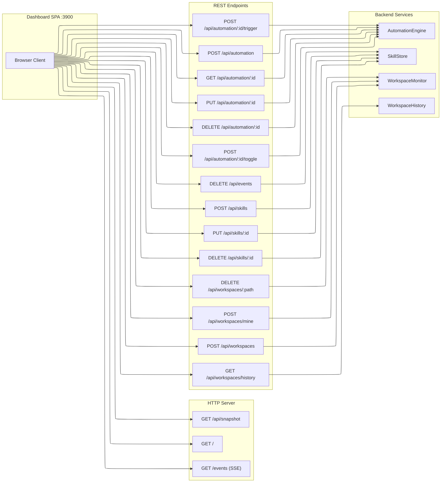

## Dashboard CRUD Sequence

```mermaid
sequenceDiagram
  participant B as Browser
  participant D as Dashboard API
  participant SS as SkillStore
  participant AE as AutomationEngine
  participant WM as WorkspaceMonitor
  participant WH as WorkspaceHistory

  rect rgb(40, 40, 80)
  Note over B,SS: Skills CRUD
  B->>D: POST /api/skills {id, name, prompt, strategy}
  D->>SS: register(skill)
  SS-->>D: SkillDefinition
  D-->>B: 200 {skill}

  B->>D: PUT /api/skills/:id {updates}
  D->>SS: update(id, updates)
  SS-->>D: updated SkillDefinition
  D-->>B: 200 {skill}

  B->>D: DELETE /api/skills/:id
  D->>SS: remove(id)
  D-->>B: 200 {removed: true}
  end

  rect rgb(40, 80, 40)
  Note over B,AE: Automation CRUD
  B->>D: POST /api/automation {rule}
  D->>AE: registerRule(rule)
  AE-->>D: AutomationRule
  D-->>B: 200 {rule}

  B->>D: POST /api/automation/:id/toggle {enabled}
  D->>AE: toggleRule(id, enabled)
  D-->>B: 200 {toggled: true}

  B->>D: POST /api/automation/:id/trigger {testData}
  D->>AE: triggerRule(id, testData)
  D-->>B: 200 {result}
  end

  rect rgb(80, 40, 40)
  Note over B,WH: Workspace Operations
  B->>D: POST /api/workspaces {path}
  D->>WM: startMonitoring(path)
  D-->>B: 200 {monitoring: true}

  B->>D: POST /api/workspaces/mine {path}
  D->>WM: mineSessions(path)
  D-->>B: 200 {mined: true}

  B->>D: DELETE /api/workspaces/:path
  D->>WM: stopMonitoring(path)
  D-->>B: 200 {stopped: true}

  B->>D: GET /api/workspaces/history
  D->>WH: getHistory()
  WH-->>D: WorkspaceEntry[]
  D-->>B: 200 {history}
  end
```

## Dashboard SPA Component Architecture

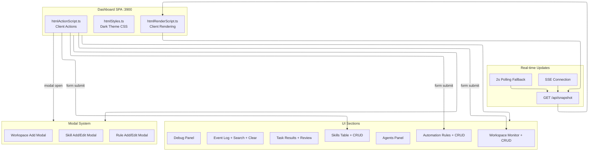

## Workspace History Lifecycle

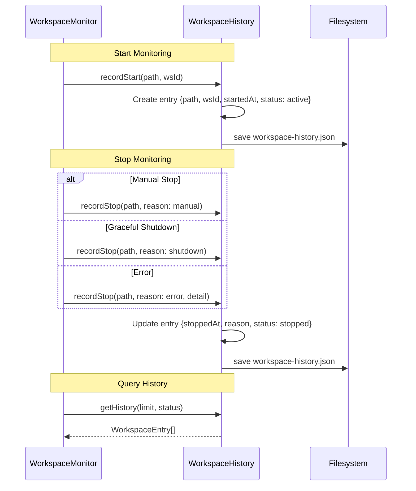

## CDP Regression Test Suite Flow

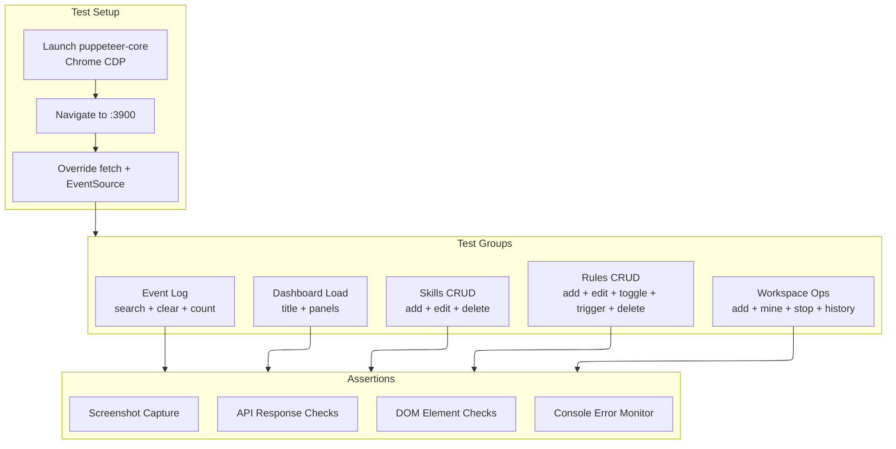
