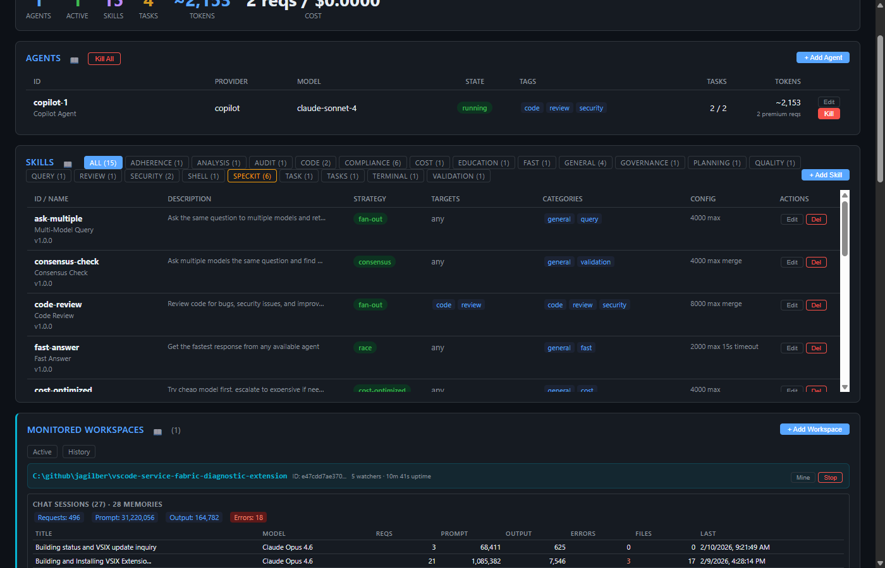
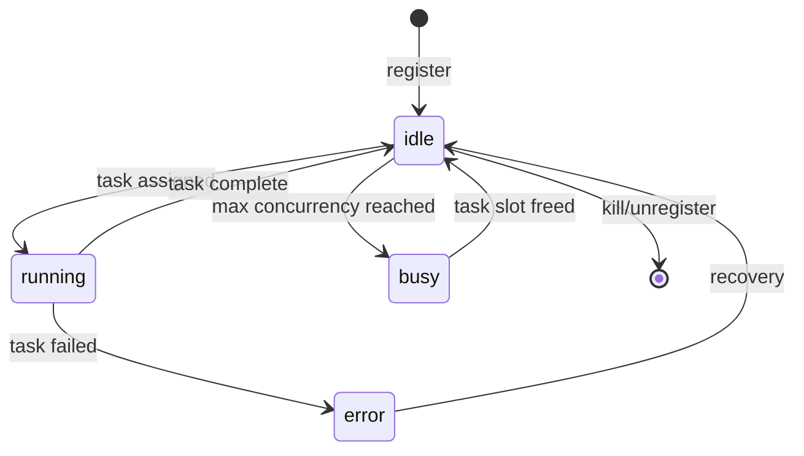
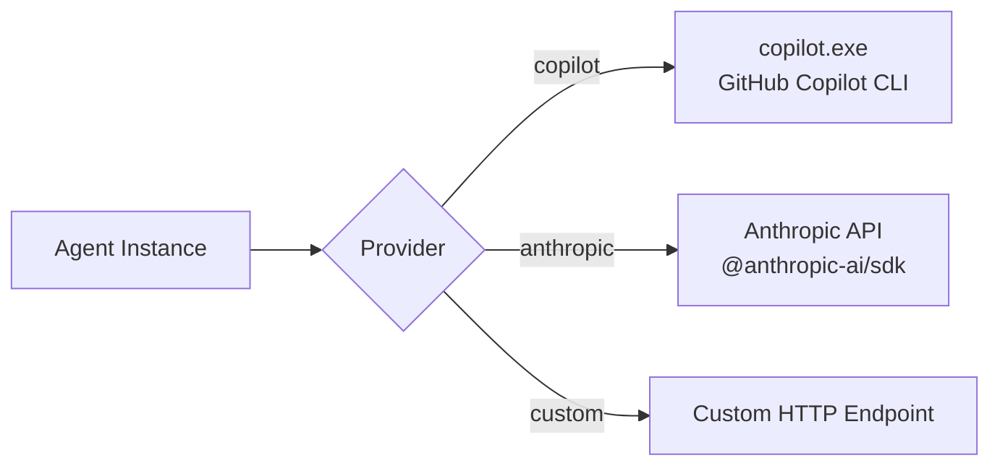

# Agents Panel

The Agents panel manages AI agent instances - the workers that execute tasks routed by the system.

## Table Columns

| Column | Description |
|--------|-------------|
| **ID** | Unique agent identifier + display name |
| **Provider** | Backend provider (`copilot`, `anthropic`, `openai`, `custom`) |
| **Model** | LLM model name (e.g., `claude-sonnet-4`, `gpt-4o`) |
| **State** | Current state: `idle`, `running`, `busy`, `stopped`, `error` |
| **Tags** | Routing tags for skill targeting (e.g., `code`, `review`, `security`) |
| **Tasks** | Completed / Total task count |
| **Tokens** | Cumulative token usage + premium request count |

## Actions

| Action | Description |
|--------|-------------|
| **+ Add Agent** | Opens modal to register a new agent with provider, model, tags, and configuration |
| **Kill All** | Terminates all registered agents and their sessions |
| **Edit** | Opens modal to modify agent configuration (tags, model, concurrency, etc.) |
| **Kill** | Terminates a specific agent and its active session |

## Agent Configuration Fields

When adding or editing an agent:

- **ID** - Unique identifier (immutable after creation)
- **Name** - Human-readable display name
- **Provider** - Backend: `copilot` (GitHub Copilot CLI), `anthropic` (Anthropic API), etc.
- **Model** - LLM model identifier
- **Tags** - Comma-separated routing tags for skill targeting
- **Max Concurrency** - Maximum simultaneous tasks (default: 1)
- **Cost Multiplier** - Relative cost weight for cost-optimized routing
- **Timeout (ms)** - Per-task timeout in milliseconds
- **Can Mutate** - Whether the agent can modify files

## Agent States

## REST API

| Method | Endpoint | Description |
|--------|----------|-------------|
| GET | `/api/agents` | List all agents |
| POST | `/api/agents` | Register new agent |
| GET | `/api/agents/:id` | Get agent details |
| PUT | `/api/agents/:id` | Update agent config |
| POST | `/api/agents/:id/kill` | Kill specific agent |
| POST | `/api/agents/kill-all` | Kill all agents |

## Related MCP Tools

- `mgr_spawn_agent` - register and start an agent
- `mgr_stop_agent` / `mgr_stop_all` - stop agents
- `mgr_agent_status` - get agent state and metrics
- `mgr_update_agent` - modify agent configuration

## Provider Architecture

See [Architecture → Provider Layer](../architecture.md) for details.
