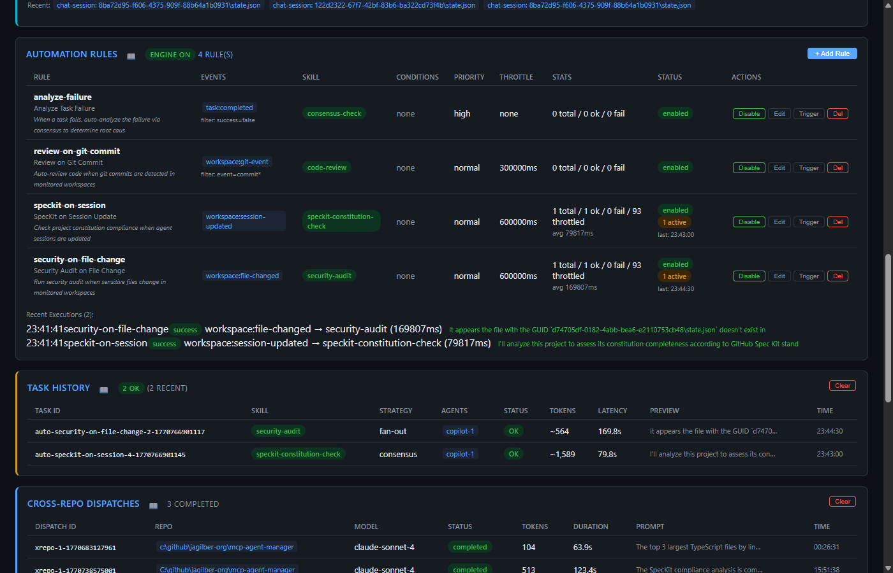
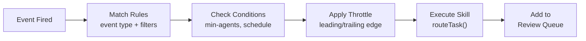

# Automation Rules Panel

The Automation Rules panel configures event-driven skill execution - automatically triggering skills when workspace events occur.

## Status Badge

The panel header shows:
- **Engine ON/OFF** - Whether the automation engine is actively processing events
- **Rule count** - Total number of registered rules

## Rules Table

| Column | Description |
|--------|-------------|
| **Rule** | Rule ID, display name, and description |
| **Events** | Event types that trigger the rule (with optional filters) |
| **Skill** | Skill ID to execute when triggered |
| **Conditions** | Additional matching conditions (e.g., `min-agents:2`) |
| **Priority** | Execution priority: `low`, `normal`, `high`, `critical` |
| **Throttle** | Minimum interval between executions (in ms) |
| **Stats** | Execution counts: total / ok / fail / throttled / skipped, with avg duration |
| **Status** | `enabled` or `disabled`, active execution count, last execution time |
| **Actions** | Enable/Disable, Edit, Trigger, Delete buttons |

## Supported Events

| Event | Description |
|-------|-------------|
| `workspace:file-changed` | A file was modified in a monitored workspace |
| `workspace:session-updated` | A VS Code chat session state changed |
| `workspace:git-event` | Git commit, branch, or other git activity detected |
| `workspace:remote-update` | Remote repository changes detected via fetch |
| `task:completed` | A task finished (success or failure) |
| `agent:registered` | A new agent was registered |
| `agent:unregistered` | An agent was removed |
| `agent:state-changed` | An agent's state changed |
| `skill:registered` | A new skill was added |
| `skill:removed` | A skill was deleted |

## Automation Pipeline

## Rule Configuration

When adding or editing a rule:

- **ID** - Unique rule identifier
- **Name** - Human-readable name
- **Description** - What the rule does
- **Skill ID** - Which skill to execute when triggered
- **Events** - Comma-separated event types to listen for
- **Priority** - Execution priority level
- **Tags** - Optional routing tags
- **Throttle Interval (ms)** - Minimum time between executions (prevents flooding)

## Recent Executions Log

Below the rules table, recent executions are displayed with:
- Timestamp, rule ID, and status badge (`success`, `failed`)
- Trigger event → skill mapping with duration
- Expandable details showing task ID, execution ID, parameters, and trigger data

## Actions

| Action | Description |
|--------|-------------|
| **+ Add Rule** | Opens modal to create a new automation rule |
| **Enable/Disable** | Toggle rule on/off without deleting |
| **Edit** | Opens modal to modify rule configuration |
| **Trigger** | Manually trigger the rule with test data |
| **Del** | Delete the rule permanently |

## REST API

| Method | Endpoint | Description |
|--------|----------|-------------|
| GET | `/api/automation` | List all rules with status |
| POST | `/api/automation` | Create new rule |
| GET | `/api/automation/:id` | Get rule details + stats |
| PUT | `/api/automation/:id` | Update rule |
| DELETE | `/api/automation/:id` | Remove rule |
| POST | `/api/automation/:id/toggle` | Enable/disable rule |
| POST | `/api/automation/:id/trigger` | Manual trigger |

## Related MCP Tools

- `mgr_create_automation` - create an automation rule
- `mgr_get_automation` - get rule details
- `mgr_update_automation` - modify a rule
- `mgr_list_automations` - list all rules
- `mgr_remove_automation` - delete a rule
- `mgr_toggle_automation` - enable/disable a rule
- `mgr_trigger_automation` - manually trigger a rule
- `mgr_automation_status` - get engine status

## Persistence

Rules are stored in `automation/rules.json`. Execution history and stats are in-memory only.

See [Architecture → Event Flow](../architecture.md) for the full event pipeline.
