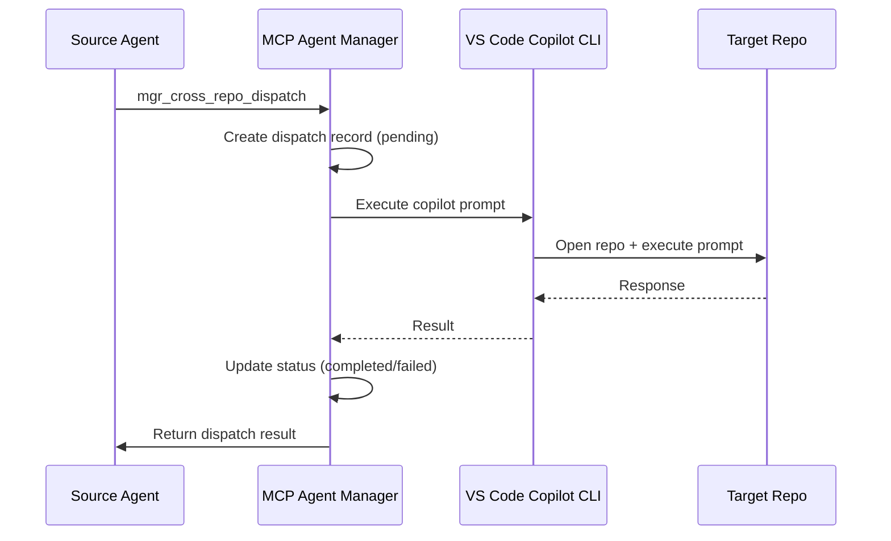

# Cross-Repo Dispatches Panel

The Cross-Repo Dispatches panel tracks prompt dispatches sent to other repositories via the VS Code Copilot CLI. This enables multi-repo orchestration where an agent in one workspace can trigger work in another.

## Status Summary

The header displays:
- **Active** - Number of dispatches currently in-progress
- **Total** - Total dispatches (all statuses)

## Table Columns

| Column | Description |
|--------|-------------|
| **ID** | Unique dispatch identifier |
| **Repo** | Target repository (owner/name format) |
| **Branch** | Git branch context for the dispatch |
| **Status** | `pending` (yellow), `active` (blue), `completed` (green), or `failed` (red) |
| **Request** | First 100 chars of the dispatched prompt |
| **Response** | First 100 chars of the response (when completed) |
| **Time** | Dispatch timestamp |

## Dispatch Flow

## Actions

| Action | Description |
|--------|-------------|
| **Clear** | Delete all cross-repo dispatch history (confirmation required) |

## REST API

| Method | Endpoint | Description |
|--------|----------|-------------|
| POST | `/api/cross-repo` | Create a new cross-repo dispatch |
| GET | `/api/cross-repo` | List all dispatches |
| GET | `/api/cross-repo/:id` | Get a specific dispatch |
| DELETE | `/api/cross-repo` | Clear all dispatch history |

## Related MCP Tools

- `mgr_cross_repo_dispatch` - dispatch a prompt to another repository
- `mgr_cross_repo_status` - check status of a dispatch
- `mgr_cross_repo_history` - list past dispatches
- `mgr_cross_repo_cancel` - cancel a pending dispatch

## Persistence

Dispatch records are persisted to `state/crossrepo-history.jsonl` (JSONL format). Session logs for individual dispatches are stored in `logs/cross-repo-sessions/`.

## Requirements

Cross-repo dispatch requires:
- VS Code Copilot CLI installed and authenticated
- Target repository cloned locally or accessible
- Network connectivity between workspaces

See [Architecture → Cross-Repo](../architecture.md) for full details.
