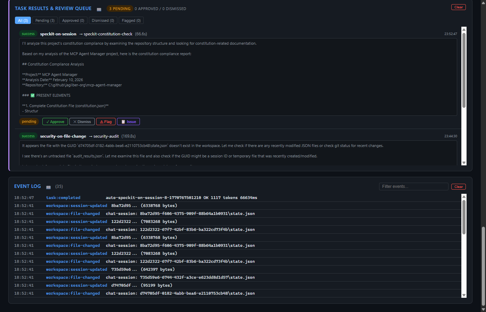
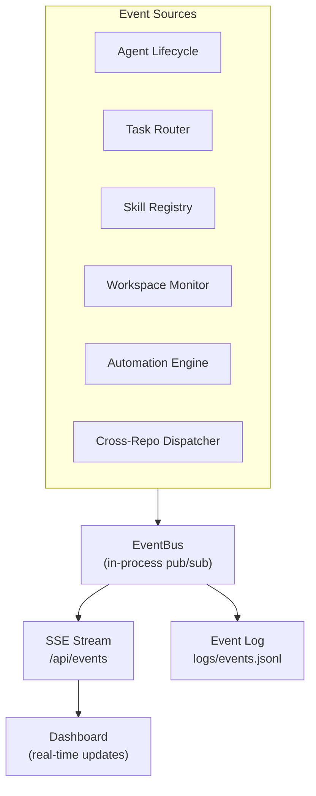

# Event Log Panel

The Event Log panel displays a real-time stream of all system events published through the internal EventBus. Events flow in via Server-Sent Events (SSE) for instant visibility.

## Event Types

| Event | Description |
|-------|-------------|
| `agent:registered` | New agent registered |
| `agent:updated` | Agent configuration changed |
| `agent:killed` | Agent process terminated |
| `task:assigned` | Task dispatched to agent(s) |
| `task:completed` | Task execution finished |
| `skill:registered` | New skill registered |
| `skill:removed` | Skill removed |
| `workspace:discovered` | New workspace detected by monitor |
| `session:mined` | Copilot session mined from workspace |
| `automation:triggered` | Automation rule fired |
| `automation:executed` | Automation rule execution completed |
| `cross-repo:dispatched` | Cross-repo prompt sent |
| `cross-repo:completed` | Cross-repo dispatch finished |

## Display Format

Each event row shows:
- **Timestamp** - When the event occurred
- **Type badge** - Color-coded event type
- **Summary** - Event-specific detail text

Events are displayed newest-first and auto-scroll as new events arrive.

## Event Delivery Architecture

## Actions

| Action | Description |
|--------|-------------|
| **Search box** | Filter events by text content |
| **Clear** | Delete all event log entries |

## REST API

| Method | Endpoint | Description |
|--------|----------|-------------|
| GET | `/api/events` | SSE stream - real-time event delivery |
| DELETE | `/api/events` | Clear all events |

Events are also included in the `/api/snapshot` response under `events`.

## Polling Fallback

If SSE connection drops, the dashboard automatically falls back to polling `/api/snapshot` every 5 seconds and reconciles event state.

## Persistence

Events are logged to `logs/events.jsonl` in JSONL append-only format. Each line contains a JSON object with `timestamp`, `type`, and event-specific payload fields.

See [Architecture → Event System](../architecture.md) for the full event architecture.
