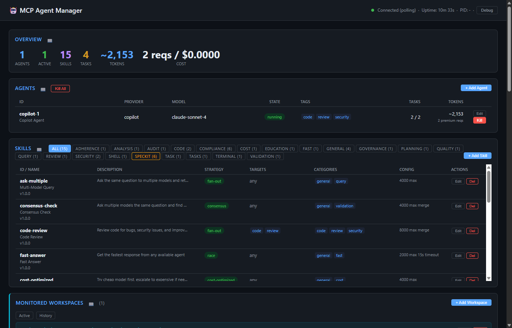

# Overview Panel

The Overview panel provides a real-time summary of core system metrics at a glance.

## Metrics

| Metric | Description |
|--------|-------------|
| **Agents** | Total number of registered agents |
| **Active** | Agents currently in `running` or `busy` state |
| **Skills** | Total skill definitions loaded |
| **Tasks** | Total tasks executed since server start |
| **Tokens** | Cumulative estimated token usage (prefixed with `~` when estimated) |
| **Cost** | Aggregate cost - shown as premium request count and dollar amount |

## Data Source

All values come from the `/api/snapshot` endpoint, updated in real-time via SSE or polling (every 2s fallback).

## Related MCP Tools

- `mgr_get_metrics` - retrieve router metrics programmatically
- `mgr_list_agents` - list all registered agents
- `mgr_list_skills` - list all loaded skills

## Architecture Reference

See [Architecture → System Architecture](../architecture.md) for the full system diagram.
