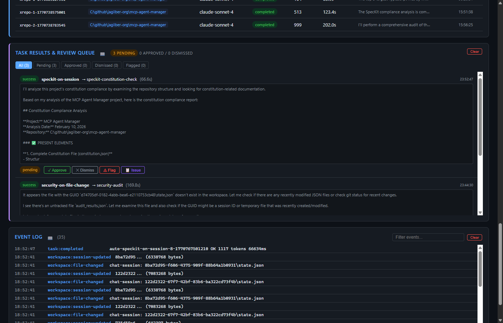
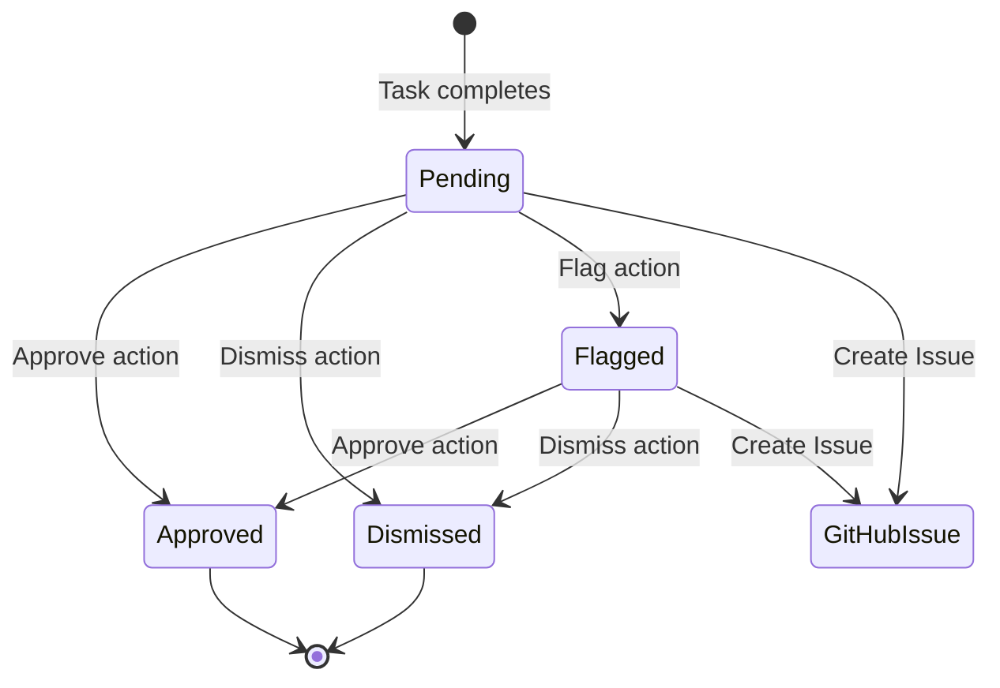

# Task Results & Review Queue Panel

The Task Results & Review Queue panel provides a review workflow for task outputs. Results from task execution can be reviewed, approved, dismissed, flagged, or escalated to GitHub issues.

## Filter Tabs

| Tab | Description |
|-----|-------------|
| **All** | Show all results regardless of status |
| **Pending** | Results awaiting review (default view) |
| **Approved** | Results that have been approved |
| **Dismissed** | Results that have been dismissed |
| **Flagged** | Results flagged for further attention |

## Table Columns

| Column | Description |
|--------|-------------|
| **Task** | Task ID that produced this result |
| **Skill** | Skill ID used (green badge) |
| **Preview** | Truncated content preview |
| **Status** | Review status badge (Pending/Approved/Dismissed/Flagged) |
| **Actions** | Action buttons based on current status |

## Review Workflow

## Actions

| Action | Location | Description |
|--------|----------|-------------|
| **Approve** | Row button | Mark result as approved |
| **Dismiss** | Row button | Dismiss the result |
| **Flag** | Row button | Flag for further review |
| **Issue** | Row button | Create a GitHub issue from the result |
| **Clear** | Header button | Clear all review queue entries |

### GitHub Issue Creation

The "Issue" action opens a pre-filled GitHub issue URL containing:
- Task ID and skill reference in the title
- Full result content in the body
- Appropriate labels for triage

## REST API

| Method | Endpoint | Description |
|--------|----------|-------------|
| GET | `/api/review` | List review queue items (optional `?status=` filter) |
| POST | `/api/review/:id/approve` | Approve a result |
| POST | `/api/review/:id/dismiss` | Dismiss a result |
| POST | `/api/review/:id/flag` | Flag a result |
| DELETE | `/api/review` | Clear all review queue items |

## Related MCP Tools

- `mgr_get_feedback` - get a specific feedback/review item
- `mgr_list_feedback` - list feedback items
- `mgr_submit_feedback` - submit new feedback
- `mgr_update_feedback` - update feedback status

## Persistence

Review queue items are stored in `state/review-queue.json`. Each item tracks the task ID, skill, content, review status, reviewer identity, and timestamps.

See [Architecture → Feedback Loop](../architecture.md) for the full review workflow.
