# Skills Panel

Skills define reusable task templates with routing strategies, prompt templates, and agent targeting rules.

## Category Filters

The top filter bar shows all skill categories with counts. Click a category to filter the table. Categories include: `code`, `review`, `security`, `speckit`, `compliance`, `general`, `fast`, `cost`, `education`, `governance`, `planning`, `quality`, `query`, `validation`, `shell`, `terminal`, `task`, etc.

SpecKit categories are highlighted with a distinct purple/border style.

## Table Columns

| Column | Description |
|--------|-------------|
| **ID / Name** | Unique skill identifier, display name, and version |
| **Description** | Brief description of what the skill does |
| **Strategy** | Routing strategy badge (see below) |
| **Targets** | Target agents by ID or tags, or `any` if no restriction |
| **Categories** | Category tags for filtering and organization |
| **Config** | Max tokens, merge mode, timeout settings |
| **Actions** | Edit or Delete buttons |

## Routing Strategies

```mermaid
flowchart TB
    REQ[Task Request] --> STRAT{Strategy}
    STRAT -->|single| S1["Pick first available agent<br/>→ 1 response"]
    STRAT -->|race| S2["Send to all in parallel<br/>→ first success wins"]
    STRAT -->|fan-out| S3["Send to all in parallel<br/>→ collect all responses"]
    STRAT -->|consensus| S4["Send to all agents<br/>→ merge responses with headers"]
    STRAT -->|fallback| S5["Try cheapest first<br/>→ escalate on failure"]
    STRAT -->|cost-optimized| S6["Start with cheapest<br/>→ escalate if response too short"]
```

| Strategy | Behavior | Use Case |
|----------|----------|----------|
| `single` | One agent, one response | Simple queries, explanations |
| `race` | All agents in parallel, first success wins | Speed-critical tasks |
| `fan-out` | All agents in parallel, collect all | Multi-perspective analysis |
| `consensus` | All agents, merge with agent headers | Agreement/validation tasks |
| `fallback` | Sequential cheapest-first | Cost-efficient with reliability |
| `cost-optimized` | Cheapest first, escalate if inadequate | Budget-conscious routing |

## Skill Configuration

When adding or editing a skill:

- **ID** - Unique identifier (immutable after creation)
- **Name** - Human-readable display name
- **Description** - What the skill does
- **Prompt Template** - Template with `{variable}` placeholders (e.g., `{prompt}`, `{code}`)
- **Strategy** - One of the six routing strategies above
- **Target Tags** - Comma-separated tags to match agents (e.g., `code, review`)
- **Categories** - Comma-separated categories for organization
- **Max Tokens** - Maximum response token limit
- **Timeout (ms)** - Per-execution timeout

## Ask Agent

The skill modal includes a **🤖 Ask Agent** button that sends the current form data to an active agent for refinement suggestions. The agent reviews fields and recommends improvements.

## REST API

| Method | Endpoint | Description |
|--------|----------|-------------|
| GET | `/api/skills` | List all skills |
| POST | `/api/skills` | Create new skill |
| GET | `/api/skills/:id` | Get skill definition |
| PUT | `/api/skills/:id` | Update skill (auto-increments patch version) |
| DELETE | `/api/skills/:id` | Remove skill |

## Related MCP Tools

- `mgr_register_skill` - create a new skill definition
- `mgr_get_skill` - retrieve skill details
- `mgr_update_skill` - modify skill configuration
- `mgr_remove_skill` - delete a skill
- `mgr_list_skills` - list all skills with filtering

## Architecture Reference

See [Architecture → Task Routing Strategies](../architecture.md) and [Plan → Strategies, Skills & Metrics](../plan-strategies-skills-metrics.md).
