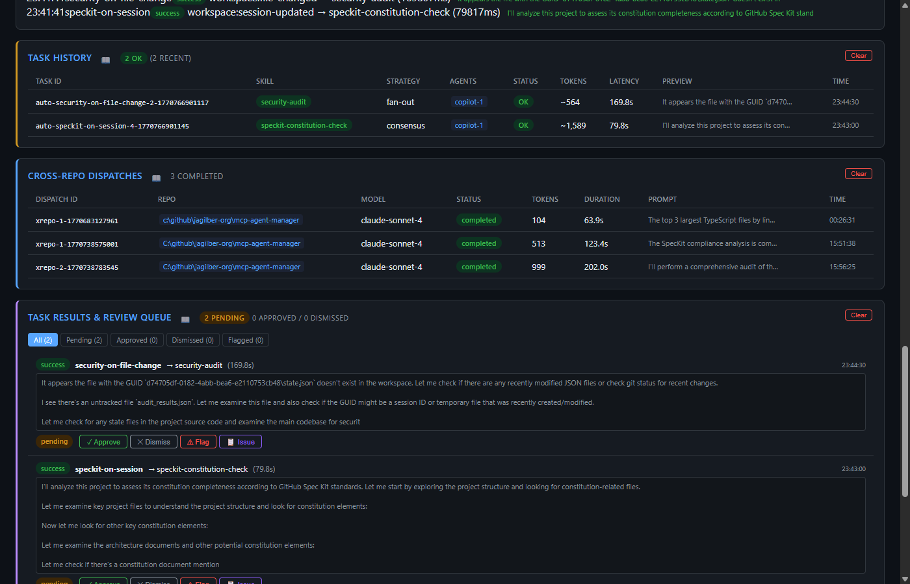
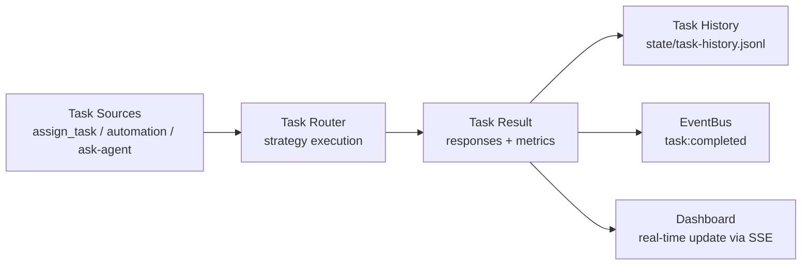

# Task History Panel

The Task History panel shows all tasks executed through the task router - whether triggered manually via `mgr_assign_task`, through automation rules, or via the dashboard's Ask Agent feature.

## Status Summary

The header shows:
- **OK count** - Tasks that completed successfully (green badge)
- **Failed count** - Tasks that failed (red badge, if any)
- **Recent count** - Total tasks in the current view

## Table Columns

| Column | Description |
|--------|-------------|
| **Task ID** | Unique task identifier (auto-generated for automation tasks) |
| **Skill** | Skill ID that was executed (green badge) |
| **Strategy** | Routing strategy used (`single`, `race`, `fan-out`, `consensus`, etc.) |
| **Agents** | Agent(s) that executed the task (tag badges) |
| **Status** | `OK` (green) or `FAIL` (red) |
| **Tokens** | Estimated token usage (prefixed with `~` when estimated) |
| **Latency** | Total execution time in seconds |
| **Preview** | First 80 chars of the response content (hover for full preview) |
| **Time** | Completion timestamp |

## Expandable Detail Rows

Click any task row to expand a detail view showing:
- Full content preview (scrollable, max 200px height)
- Error message (in red) if the task failed
- Pre-formatted text with whitespace preserved

## Actions

| Action | Description |
|--------|-------------|
| **Clear** | Delete all task history entries (confirmation required) |

## Data Flow

## REST API

| Method | Endpoint | Description |
|--------|----------|-------------|
| DELETE | `/api/task-history` | Clear all task history |

Task history is included in the `/api/snapshot` response under `router.recentTasks`.

## Related MCP Tools

- `mgr_assign_task` - execute a task using a skill
- `mgr_send_prompt` - send a one-off prompt to an agent
- `mgr_list_task_history` - list task history programmatically
- `mgr_get_metrics` - get router performance metrics

## Persistence

Task history is persisted to `state/task-history.jsonl` using JSONL append-only format. Each entry records the task ID, skill, strategy, agents, success status, tokens, latency, content preview, and timestamps.

See [Architecture → Task Routing Strategies](../architecture.md) for the routing flow.
