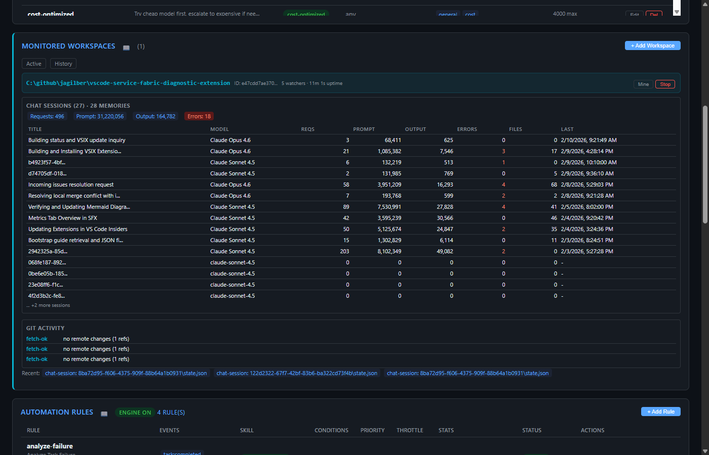
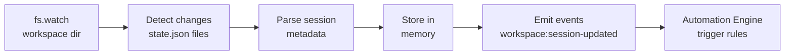

# Monitored Workspaces Panel

The Monitored Workspaces panel tracks local repositories in real-time, mining VS Code chat sessions, git activity, and file changes to feed the automation engine.

## Tabs

- **Active** - Currently monitored workspaces with live watchers
- **History** - Previously monitored workspaces with stop reason and duration

## Workspace Card

Each monitored workspace shows:

| Section | Description |
|---------|-------------|
| **Path** | Full filesystem path to the workspace |
| **Workspace ID** | VS Code workspace identifier (first 12 chars) |
| **Watchers** | Number of active `fs.watch` handles |
| **Uptime** | Time since monitoring started |
| **Mine** | Trigger immediate session mining |
| **Stop** | Stop monitoring this workspace |

## Chat Sessions Table

Displays all discovered VS Code Copilot chat sessions within the workspace:

| Column | Description |
|--------|-------------|
| **Title** | Session title or truncated session ID |
| **Model** | Most recently used LLM model |
| **Reqs** | Total API request count |
| **Prompt** | Total prompt tokens consumed |
| **Output** | Total output tokens generated |
| **Errors** | Error count (highlighted in red if > 0) |
| **Files** | Number of files modified in the session |
| **Last** | Timestamp of the most recent request |

Aggregate totals (Requests, Prompt, Output, Errors) appear above the table.

## Git Activity Section

Shows recent git events detected by the workspace monitor:

- `fetch-ok` - Remote fetch completed, with change status
- `commit` - New commits detected
- `branch` - Branch creation/deletion/switch events
- Recent file changes shown as tagged chips

## Session Mining

The monitor watches VS Code's workspace storage directory for `state.json` files, extracting:
- Session IDs and titles
- Model usage and token counts
- Request/error counts
- Modified file lists

## History Tab

When monitoring is stopped (manually or on shutdown), an entry is recorded:

| Column | Description |
|--------|-------------|
| **Path** | Workspace path |
| **Started** | When monitoring began |
| **Stopped** | When monitoring ended |
| **Duration** | Total monitoring time |
| **Sessions** | Number of sessions discovered |
| **Git Events** | Number of git events captured |
| **Reason** | `manual` or `shutdown` |

## REST API

| Method | Endpoint | Description |
|--------|----------|-------------|
| GET | `/api/workspaces` | List all monitored workspaces |
| POST | `/api/workspaces` | Start monitoring a workspace path |
| GET | `/api/workspaces/:path` | Get workspace detail |
| DELETE | `/api/workspaces/:path` | Stop monitoring |
| POST | `/api/workspaces/:path/mine` | Trigger immediate mining |
| GET | `/api/workspace-history` | List workspace history entries |

## Related MCP Tools

- `mgr_monitor_workspace` - start monitoring a workspace
- `mgr_stop_monitor` - stop monitoring
- `mgr_monitor_status` - get monitoring status
- `mgr_mine_sessions` - trigger manual session mining
- `mgr_get_workspace` - get workspace details
- `mgr_list_workspace_history` - list past monitoring sessions

## Persistence

- Active monitors: `config/monitors.json` (JSON array of paths)
- History: `config/workspace-history.json` (JSON array)
- Monitors auto-restore on server restart

See [Architecture → Core Services](../architecture.md) for the WorkspaceMonitor component.
